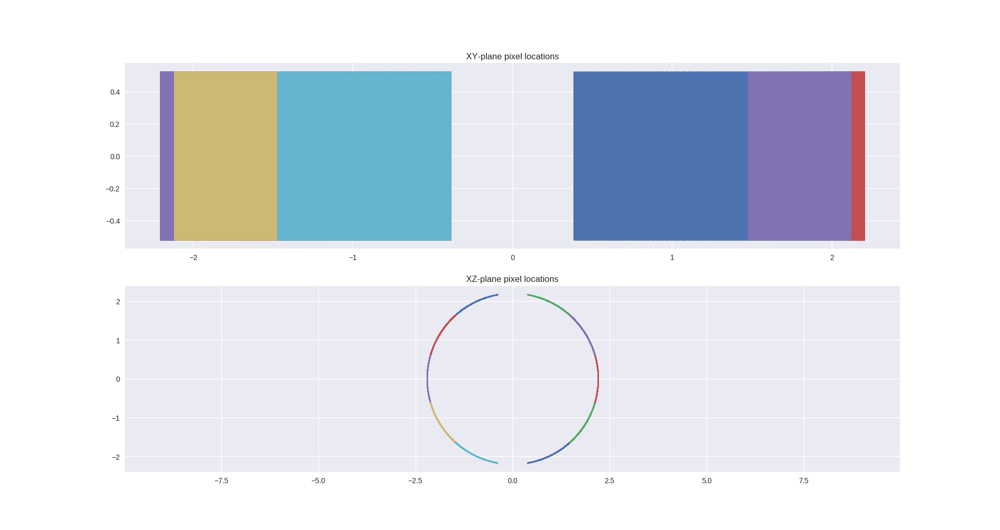

# python-nexus-utilities
Functions to assist with building example NeXus files in the proposed format for ESS from existing NeXus files and Mantid IDFs.

Tested with Python 3.6, >=3.4 should be fine. You can install dependencies with
```
pip install -r requirements.txt
```

To display the plots generated by `DetectorPlotter` you may need to install tk libraries, on Ubuntu for example:
```
sudo apt install python3-tk
```
on CentOS (with EPEL installed):
```
sudo yum install python34-tkinter
```

## To create a NeXus file

Use `python nexusutils/build.py <input_IDF_file_path>`.

To view a list of optional arguments use `./build.py --help` 

## Examples

Scripts to generate example NeXus files for the ESS can be found at https://github.com/ess-dmsc/generate-nexus-files

## Tools

To assist in creating the IDF to NeXus conversion scripts there are a couple of simple tools: "Detector Plotter" and "HDF5 Size Profiler". 

### Detector Plotter

Plots the pixel offsets in the XY and XZ planes.

Usage example:
```python
from nexusutils.detectorplotter import DetectorPlotter
plotter = DetectorPlotter('example_instruments/wish/WISH_example_gzip_compress.hdf5')
plotter.plot_pixel_positions()
```
example output:



### HDF5 Size Profiler

Prints a table of datasets (ignoring links) from largest to smallest with details of data type, number of elements etc. Can also output a pie chart of dataset sizes.

Usage example:
```python
from nexusutils.hdf5sizeprofiler import HDF5SizeProfiler
profiler = HDF5SizeProfiler('example_instruments/wish/WISH_example_gzip_compress.hdf5')
profiler.print_stats_table()
profiler.draw_pie_chart()
```
example table output (truncated):
```
Total uncompressed size is 4.981903 megabytes, compressed file size is 1.332304 megabytes
  Size (elements)    % of total size  Datatype      Size (bytes)  Dataset name
-----------------  -----------------  ----------  --------------  -------------------------------------------------------
            77824       12.4971       float64             622592  raw_data_1/instrument/detector_1/x_pixel_offset
            77824       12.4971       float64             622592  raw_data_1/instrument/detector_1/y_pixel_offset
            77824       12.4971       float64             622592  raw_data_1/instrument/detector_1/z_pixel_offset
            77824        6.24854      int32               311296  raw_data_1/instrument/detector_1/detector_number
            77824        6.24854      int32               311296  raw_data_1/instrument/detector_10/detector_number
...
```

## Tests

Unit tests require pytest (`pip install pytest`) can be run with
```
pytest
```

An html test coverage report can be generated using pytest-cov (`pip  install pytest-cov`): 
```
pytest --cov-config .coveragerc --cov-report html --cov=. tests/
```
